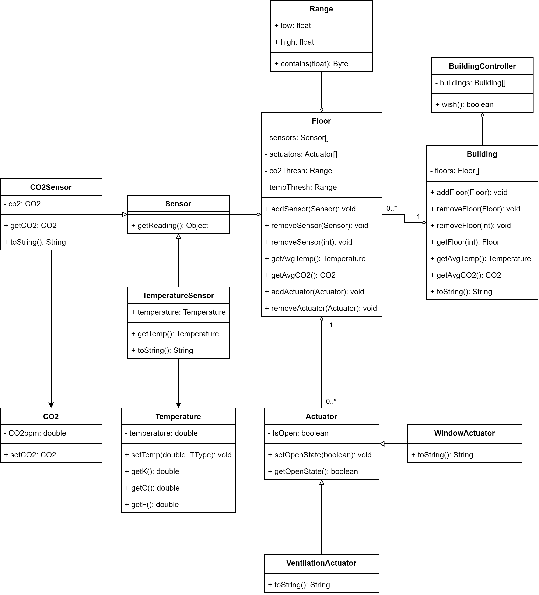
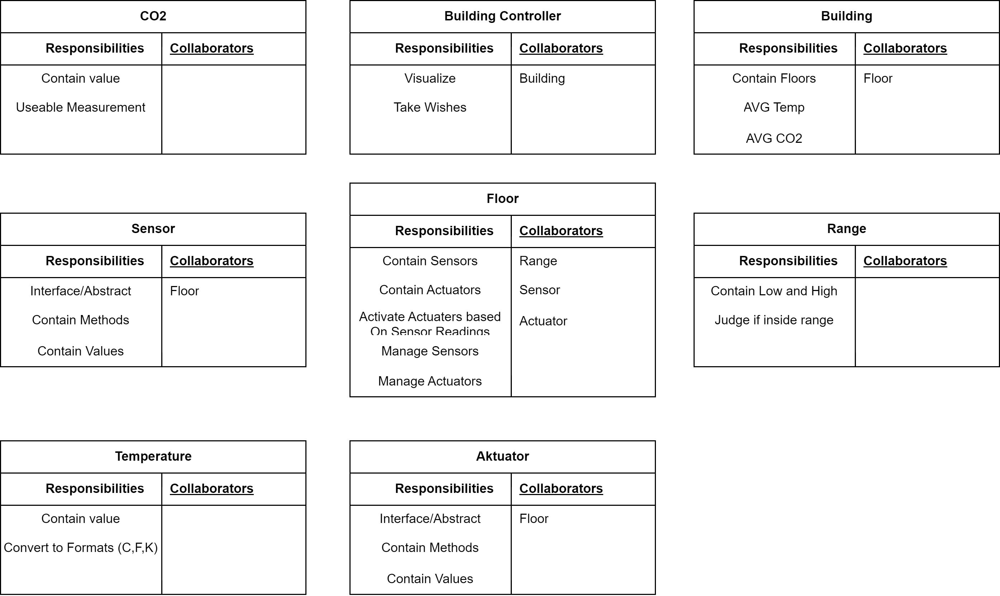

# Workshop-OOP-1
Workshop 1 for OOP på SDU.  
Dette er workshop projektet for OOP, d. 22/11/23  

## Sprint 2
Klasse diagram:  

CRC:  

## Sprint 3
Vores UML Klasse Diagram er meget anderledes fra det givne klasse diagram da det ikke indeholder units og vores har en controller for buildings for interaction.